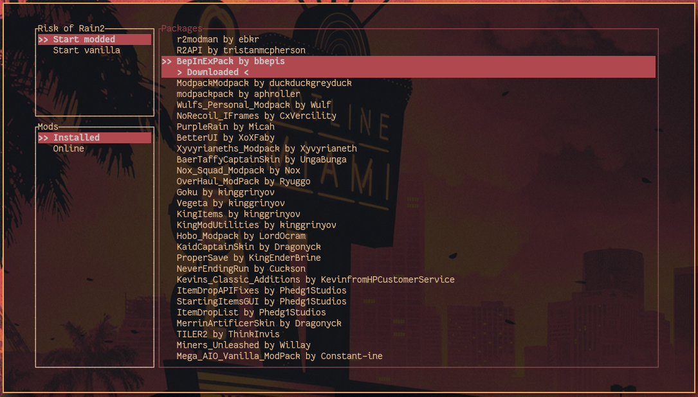

# r2modman-tui

A Risk of Rain 2 mod manager inspired by the wonderful [r2modmanPlus](https://github.com/ebkr/r2modmanPlus), but for your Linux terminal.

## WIP

This is currently a work-in-progress, but the project aims to have rough feature parity with r2modmanPlus. In particular:

- Easy installation of mods and their dependencies
- Searching of mods from https://thunderstore.io/
- Upgrading of out-of-date installed mods
- Launch modded or vanilla RoR2
- Profile imports/exports (ideally, will be compatible with r2modmanPlus share codes)
- Configuration of steam, ror2 game, and mod download directories
- Editing of mod config files (may be provided by user's `$EDITOR`)

Possible features:

- Better coloring of interface/keywords (e.g. author, whether mod is downloaded already, etc)
- Sort the list of online/installed mods by various filters
- Better testing (github actions ci?)
- Multiple user profiles

## Features

- Terminal User Interface (TUI) for quick startup and keyboard-based interaction
- Developed on Linux, so no more messing with mod managers under WINE
